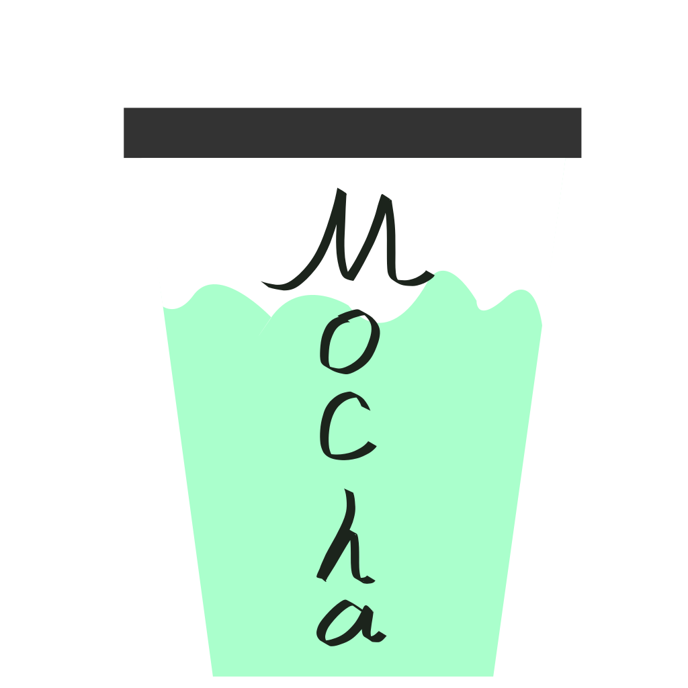

<h1>

MochaHub
</h1>

追求简洁、美观和小巧的导航页生成器。

施工中...

## 定位

优点:

- 小巧: 不使用第三方框架，甚至不使用JS
- 美观: 在做到上一条的前提下，尽可能追求美观

缺点:

- 需要现代浏览器(Chromium 92+, Firefox 105+, Safari 16+)

## License

Licensed under [AGPL-3.0-only](LICENSE)
